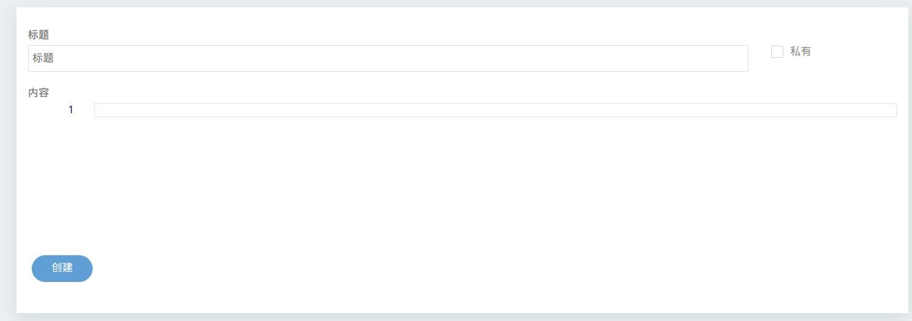

## 使用方式
### 修改main.html
插件中不包含修改后的`main.html`,若需要修改的，请阅读此部分  

打开Hydro的安装目录，在`packages/ui-default/templates`下，有一个`main.html`  

?> 如果您是常规部署，请跳过此步   
并参考Hydro部署指南中的“前端修改”   

打开它，在一言的后面(Hitokoto)插入如下内容  
```html
<div class="section side nojs--hide">
  <div class="section__header">
    <h1 class="section__title">{{ _('Application') }}</h1>
  </div>
  <a href="/paste/create" class="menu__link">
    <span class="icon icon-copy"></span>
    {{ _('pastebin') }}
  </a>
</div>
```
插入完成后代码应该是这个样子
```html
省略上文...
<div class="section side nojs--hide">
  <div class="section__header">
    <h1 class="section__title">{{ _('Hitokoto') }}</h1>
  </div>
  <div class="section__body typo" name="hitokoto"></div>
</div>
<div class="section side nojs--hide">
  <div class="section__header">
    <h1 class="section__title">{{ _('Application') }}</h1>
  </div>
  <a href="/paste/create" class="menu__link">
    <span class="icon icon-copy"></span>
    {{ _('pastebin') }}
  </a>
</div>
省略下文...
```
### 创建第一个剪贴板
进入`/paste/create`路由，您应该能看到如下画面  
  
输入标题，内容，选择是否私有即可创建！  

?> 注：当前并未有关于确认输入数据是否有效的实现，请管理员注意查看数据库，以免发生恶意大批量创建剪贴板的悲剧！
### 查看剪贴板
创建完成后，会重定向到创建完成的链接，这就是剪贴板的永久链接！  
当您将剪贴板设为私有后，仅有您能查看该剪贴板！其他人查看会出现NotFound的错误！